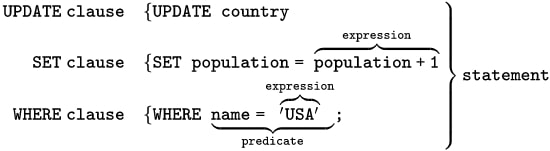

# Chapter 2 - Understanding Basic SQL Syntax

## 2.1 The SQL Syntax

The SQL language is subdivided into several language elements, including:

* **Clauses**, which are constituent components of statements and queries. (In some cases, these are optional.)[17]
* **Expressions**, which can produce either scalar values, or tables consisting of columns and rows of data
* **Predicates**, which specify conditions that can be evaluated to SQL three-valued logic (3VL) (true/false/unknown) or 
  Boolean truth values and are used to limit the effects of statements and queries, or to change program flow.
* **Queries**, which retrieve the data based on specific criteria. This is an important element of SQL.
* **Statements**, which may have a persistent effect on schemata and data, or may control transactions, program flow, 
  connections, sessions, or diagnostics.
* SQL statements also include the semicolon (";") statement terminator. Though not required on every platform, it is 
  defined as a standard part of the SQL grammar.
* Insignificant **whitespace** is generally ignored in SQL statements and queries, making it easier to format SQL code for readability.



## 2.2 Basic SQL Commands - SELECT

The `SELECT` query retrieves one or more rows from one or more tables.

**Syntax:**
```sql
SELECT column1, column2, ... FROM table_name;

or

SELECT * FROM table_name; 
```

**Example:**
```sql
SELECT first_name, last_name FROM contacts;

# * means select all
SELECT * FROM contacts; 
```

## 2.3 Basic SQL Commands - INSERT

The `INSERT` command Adds one or more rows into a table.

**Syntax:**
```sql
INSERT INTO table_name (column1, column2, column3, ...) VALUES (value1, value2, value3, ...);
or
INSERT INTO table_name VALUES (value1, value2, value3, ...);
```

**Example:**

```sql
INSERT INTO Customers (CustomerName, ContactName, Address, City, PostalCode, Country)
VALUES ('Cardinal', 'Tom B. Erichsen', 'Skagen 21', 'Stavanger', '4006', 'Norway');
```

## 2.4 Basic SQL Commands - UPDATE

The `UPDATE` command modifies one or more rows in a table.

**Syntax:**
```sql
UPDATE table_name
SET column1 = value1, column2 = value2, ...
WHERE condition;
```

**Example:**
```sql
UPDATE Customers
SET ContactName = 'Alfred Schmidt', City= 'Frankfurt'
WHERE CustomerID = 1;
```

**Note:** If `WHERE` clause is not specified, the update will run across the entire table.

## 2.5 Basic SQL Commands - DELETE

The `DELETE` command removes one or more rows from one table.

**Syntax:**
```sql
DELETE FROM table_name WHERE condition;
```

**Example:**
```sql
DELETE FROM Customers WHERE CustomerName='Alfreds Futterkiste';
```

**Note:** If `WHERE` clause is not mentioned, then all the rows are deleted.
